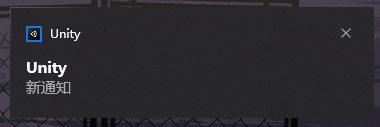

# Unity-ToastSender
[Chinese](README.md)
[English](README-EN.md)

Normally, Unity needs to set BuildTarget to UWP to use the Toast API. This tool uses PS1 script to pass information to Toast for you to send.

I've placed the DLL I used in Plugins. The PS1 code will load the DLL and execute its contents for you, but can it be called directly from C#? The code could be written more elegantly if possible.

# You need to know

* Toast is a Windows tool, not available on other platforms, maybe in some other form.
* It is not tested if it can be used at Runtime, so you need to test it yourself first

# How to use

Install From Unity Package Manager:`https://github.com/HikariXP/Unity-ToastSender.git`

Call `CharSuiToast.SendToast(title, content)` to send the notification
