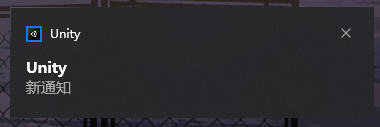

# Unity-ToastSender

正常途径下，Unity需要将BuildTarget设置为UWP才可以使用Toast相关的API，此工具通过PS1脚本代你将信息传递给Toast进行发送。

我已经将用到的DLL置于Plugins中。PS1代码的作用是帮你加载DLL以及执行其中的内容， 那这是否可以直接通过C#调用呢？如果可以的话代码可以写得更加优雅。

# You need to know

* Toast是Windows的工具，其他平台上不可用，或许是其他形式。  
* 没测试过是否可以在Runtime中使用，如果你要使用需要自己先测试

# How to use
通过Unity Package加载:`https://github.com/HikariXP/Unity-ToastSender.git`

调用CharSuiToast.SendToast来发通知

