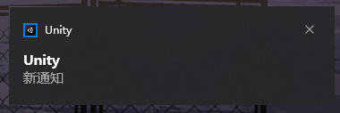

# Unity-ToastSender

Simple Plugin For Unity Send Window Toast Notification with Non-UWP Build Target.

Modify the ps1 to Adapt to your needs.

# You need to know
* First, Toast is a notification tool for Windows, and it only works on Windows.  
* Second, if you want to do something at runtime, build it to test it.(I didn't test it)

# How to use
Not need to put ps1 to Plugins Folder, just find anywhere in your project, and set the path.

Currently the ps1 script takes two arguments, but the implementation uses only one, so you'll need to change that yourself.
For Unity, you can follow the Sample implementation by opening PS1 as PowerShell and passing the parameters.

you can only download the ps1 file and use.
